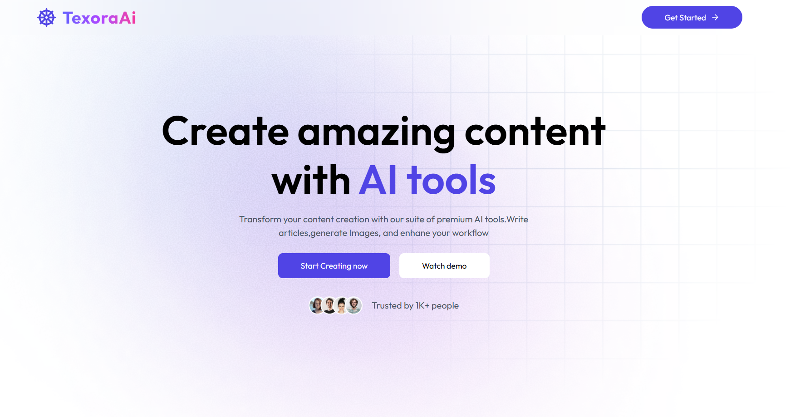
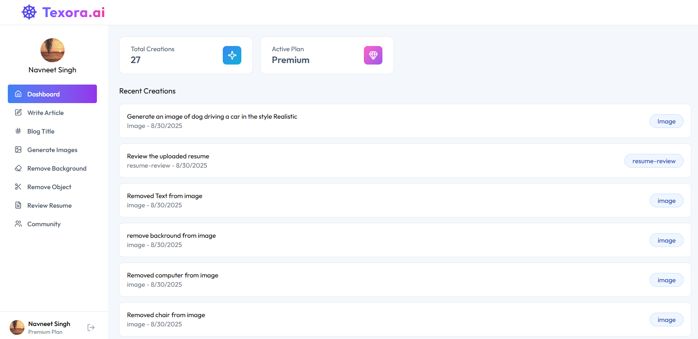
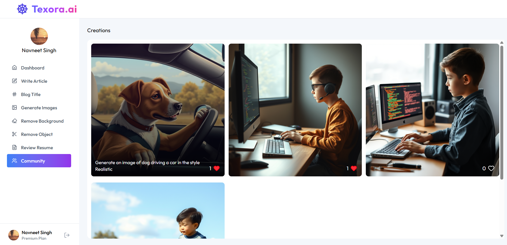

# 🚀 VerbiaAI - AI-Powered-SaaS-Platform

**Transform your content creation with cutting-edge AI technology**

[](https://Verbia-ai.vercel.app/)

[](https://github.com/Navneetsingh04/Full-Stack-Ai-SaaS-App)

[](LICENSE)

## 📖 Overview

VerbiaAI is a comprehensive AI-powered SaaS platform that provides a suite of powerful tools for content creation, image generation, and document processing. Built with modern web technologies, it offers both free and premium features to cater to different user needs.

### 🎯 Key Features

- **🤖 AI Article Writer** - Generate high-quality, engaging articles on any topic
- **📝 Blog Title Generator** - Create catchy and SEO-friendly blog titles
- **🎨 AI Image Generation** - Create stunning visuals with multiple artistic styles
- **🖼️ Background Removal** - Remove backgrounds from images effortlessly
- **✂️ Object Removal** - Remove unwanted objects from images seamlessly
- **📄 Resume Reviewer** - Get AI-powered feedback on your resume

## 🖼️ Screenshots

| Landing Page                                                  | AI Tools Dashboard                                    | Image Generation                                                      |
| ------------------------------------------------------------- | ----------------------------------------------------- | --------------------------------------------------------------------- |
|  |  |  |

## 🛠️ Tech Stack

### Frontend

- **React 19** - Latest React with concurrent features
- **Vite** - Lightning-fast build tool and dev server
- **Tailwind CSS** - Utility-first CSS framework
- **React Router** - Client-side routing
- **Clerk** - Authentication and user management
- **Lucide React** - Beautiful icon library
- **React Hot Toast** - Elegant notifications
- **React Markdown** - Markdown rendering
- **Axios** - HTTP client

### Backend

- **Node.js** - JavaScript runtime
- **Express.js** - Web application framework
- **Gemini API** - AI model integration
- **Cloudinary** - Image storage and manipulation
- **Neon Database** - Serverless PostgreSQL
- **Clerk Express** - Backend authentication
- **Multer** - File upload handling
- **PDF Parse** - PDF document processing

### Deployment

- **Vercel** - Frontend and backend hosting
- **PostgreSQL** - Database (Neon)
- **Cloudinary CDN** - Image delivery

## 🚀 Quick Start

### Prerequisites

- Node.js 18+ installed
- npm or yarn package manager
- Accounts for: Clerk, Gemini, Cloudinary, Neon Database
- **For Docker**: Docker Desktop or Docker Engine

### 🐳 Docker Setup (Recommended)

#### 1. Clone the Repository

```bash
git clone https://github.com/Navneetsingh04/Full-Stack-Ai-SaaS-App.git
cd Full-Stack-Ai-SaaS-App
```

#### 2. Configure Environment Variables

```bash
# Copy and configure environment variables
cp .env.docker.example server/.env
# Edit server/.env with your actual API keys and database URLs
```

#### 3. Build and Run with Docker

```bash
# Build and start all services
docker-compose up --build

# Or run in detached mode
docker-compose up --build -d
```

**Access the application:**

- Frontend: http://localhost:80
- Backend API: http://localhost:3000

📖 **For detailed Docker setup instructions, see [DOCKER.md](DOCKER.md)**

### 🛠️ Manual Setup

#### 1. Clone the Repository

```bash
git clone https://github.com/Navneetsingh04/Full-Stack-Ai-SaaS-App.git
cd Full-Stack-Ai-SaaS-App
```

### 2. Install Dependencies

#### Frontend

```bash
cd client
npm install
```

#### Backend

```bash
cd ../server
npm install
```

### 3. Environment Setup

#### Backend (.env)

```env
# Database
DATABASE_URL="your_neon_database_url"

# AI API
GEMINI_API_KEY="your_gemini_api_key"
# OR
OPENAI_API_KEY="your_openai_api_key"

# Cloudinary
CLOUDNARY_CLOUD_NAME="your_cloudinary_cloud_name"
CLOUDNARY_API_KEY="your_cloudinary_api_key"
CLOUDNARY_API_SECRET="your_cloudinary_api_secret"

# Clerk
CLERK_PUBLISHABLE_KEY="your_clerk_publishable_key"
CLERK_SECRET_KEY="your_clerk_secret_key"

# CORS
CORS_ORIGIN="http://localhost:5173"
NODE_ENV="development"
PORT=3000
```

#### Frontend (.env)

```env
VITE_CLERK_PUBLISHABLE_KEY="your_clerk_publishable_key"
VITE_API_URL="http://localhost:3000"
```

### 5. Start Development Servers

#### Backend

```bash
cd server
npm run dev
```

#### Frontend (in a new terminal)

```bash
cd client
npm run dev
```

Visit `http://localhost:5173` to see the application.

## 📁 Project Structure

```
VerbiaAi/
├── client/                    # Frontend React application
│   ├── public/               # Static assets
│   ├── src/
│   │   ├── components/       # Reusable UI components
│   │   ├── pages/           # Application pages
│   │   ├── assets/          # Images and icons
│   │   ├── lib/             # Utilities (axios config)
│   │   └── App.jsx          # Main application component
│   ├── package.json
│   └── vite.config.js       # Vite configuration
├── server/                   # Backend Node.js application
│   ├── config/              # Database and service configurations
│   ├── controllers/         # Request handlers
│   ├── middlewares/         # Custom middleware
│   ├── routes/              # API route definitions
│   ├── package.json
│   └── server.js            # Express server entry point
└── README.md
```

## 🔑 API Endpoints

### AI Routes (`/api/ai`)

- `POST /generate-article` - Generate AI articles
- `POST /generate-blog-title` - Generate blog titles
- `POST /generate-image` - Create AI images
- `POST /remove-image-background` - Remove backgrounds
- `POST /remove-image-object` - Remove objects from images
- `POST /resume-review` - Analyze and review resumes

### User Routes (`/api/user`)

- User management and subscription handling

## 🎨 Features Deep Dive

### AI Article Writer

- Multiple length options (short, medium, long)
- Topic-based content generation
- Markdown rendering
- Real-time generation status

### Image Generation

- 8 different artistic styles (Realistic, Anime, Cartoon, etc.)
- Custom prompt descriptions
- Community sharing options
- High-quality image output

### Resume Reviewer

- PDF upload support (max 5MB)
- Comprehensive analysis
- Improvement suggestions
- Premium feature

### Background & Object Removal

- AI-powered precision removal
- Support for various image formats
- Download processed images
- Premium features

## 🔒 Authentication & Authorization

- **Clerk Integration** - Secure user authentication
- **JWT Tokens** - API request authorization
- **Role-based Access** - Free vs Premium features
- **Usage Limits** - Free tier limitations (10 requests)

## 🐳 Docker Deployment

This application is fully containerized with Docker for easy deployment:

- **Multi-stage builds** for optimized production images
- **Docker Compose** orchestration for full-stack deployment
- **Health checks** and restart policies
- **Environment-based configuration**

See [DOCKER.md](DOCKER.md) for complete containerization guide.

## 🚀 Deployment Options

### Docker (Recommended)

```bash
docker-compose up --build -d
```

### Traditional Hosting

- **Frontend**: Vercel, Netlify, AWS S3 + CloudFront
- **Backend**: Railway, Render, AWS ECS, Google Cloud Run
- **Database**: Neon, PlanetScale, AWS RDS

### Cloud Container Services

- **AWS**: ECS/Fargate with ECR
- **Google Cloud**: Cloud Run with Container Registry
- **Azure**: Container Instances with Container Registry

## 💳 Pricing Plans

### Free Plan

- 10 AI requests per month
- Basic article generation
- Standard image generation
- Community access

### Premium Plan

- Unlimited AI requests
- All AI tools access
- Priority processing
- Advanced features
- Resume review
- Background removal
- Object removal

## 📝 License

This project is licensed under the MIT License - see the [LICENSE](LICENSE) file for details.

## 👨‍💻 Author

**CH Waleed**

- GitHub: [@chwaleed](https://github.com/chwaleed)
